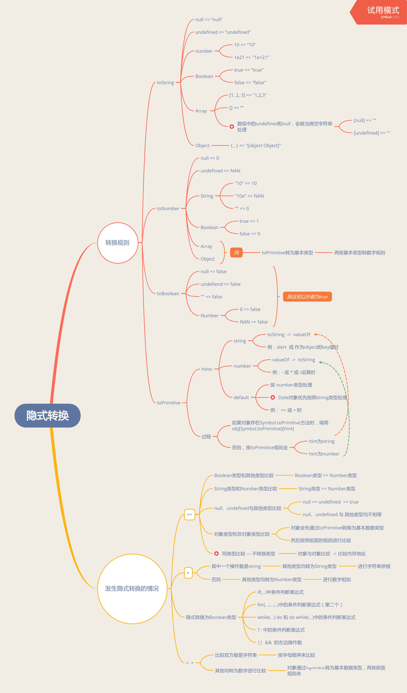

## 隐式转换 

### 参考
1. [ECMA type conversion](http://www.ecma-international.org/ecma-262/6.0/index.html#sec-type-conversion)
2. [Object to primitive conversion](https://javascript.info/object-toprimitive)
3. [从一道面试题说起—js隐式转换踩坑合集](https://juejin.im/post/5bc5c752f265da0a9a399a62)
4. [ECMAScript7规范中的ToPrimitive抽象操作](https://segmentfault.com/a/1190000016325587)
5. [js隐式装箱-ToPrimitive](https://sinaad.github.io/xfe/2016/04/15/ToPrimitive/)
6. [Symbol.toPrimitive MDN](https://developer.mozilla.org/zh-CN/docs/Web/JavaScript/Reference/Global_Objects/Symbol/toPrimitive)
7. 《你不知道的javascript 中卷》 - 第四章 强制类型转换
